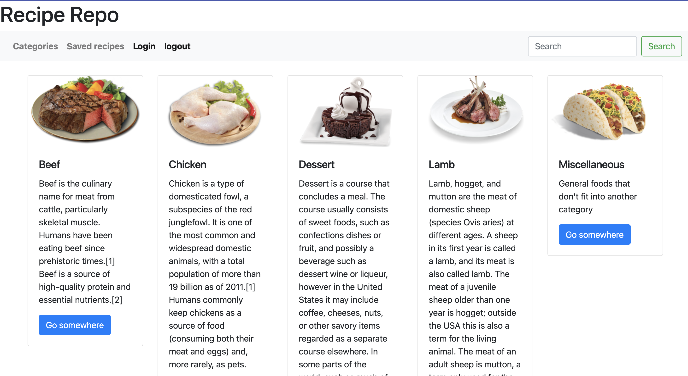

# Recipe-Repo-

## Description 

The Recipe Repo is a web application that allows users to share, save & use new & exsiting recipes saved to a user profile. When a user shares a recipe post, other users are then able to comment on the post and leave feedback.

## Table of Contents 

* [Installation](#installation)
* [Usage](#usage)
* [Credits](#credits)
* [License](#license)

## Installation

- Node.js is needed to run application
- Install npm using command lines (npm install)
- Install MySql2 (npm install MySql2)
- Install express sequelize (npm install express sequelize)
- Install dotenv to gain access to MySql (npm install dotenv)
- Install express handlebars engine template (npm install express-handlebars)
- Install express sessions (npm install express-sessions)
- Run seed files to populate table data (npm run seed)

## Usage 

## License

- No License

## Contribution
Mamona Masood
Sean Mckeags
Zach Steuer
Reggie Tenkorang

## Tests

No test were performed. 
